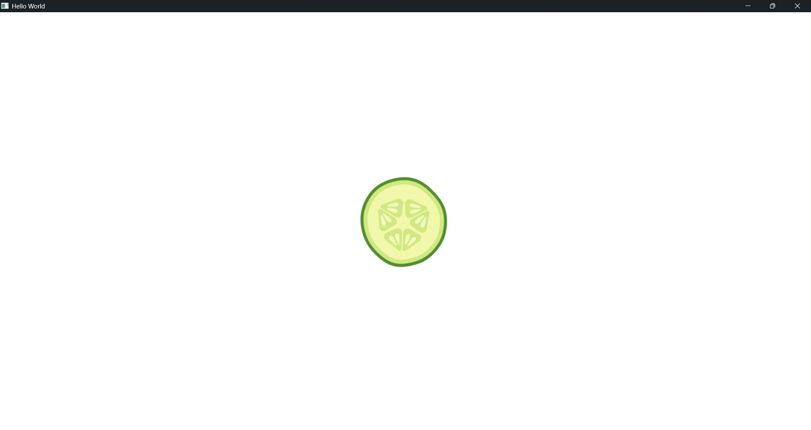

# 🎮 Kaakdi Launcher

> A PS5-style arcade game launcher built with Qt 6 and QML — designed as a custom shell for Linux and Raspberry Pi retro gaming setups.


*"Kaakdi" (काकड़ी) means cucumber in Hindi — memorable, playful, and refreshingly simple.*

---

## 📸 Screenshots

<!-- 
  TODO: Add screenshots here! Suggested shots:
  1. The splash screen with spinning logo (SplashScreen.qml) 
  2. Main arcade carousel view showing games (ArcadeFrame.qml)
  3. Grid view browsing games (GridFrame.qml)
  4. Search overlay animation (SearchPopup.qml)
  5. Game launched in RetroArch with fullscreen gameplay
  
  Format:
  
  
-->

*[placeholder for screenshots — see suggestions at the bottom of this README]*

---

## ✨ Features

- **PS5-style carousel UI** — smooth horizontal scrolling with animated selection, logo reveals, and cross-fade backgrounds
- **Grid view** — browse your entire library at a glance with scale-up animations
- **Dual-layer background crossfade** — seamless transition between game backgrounds when browsing
- **Animated splash screen** — spinning logo with fade-out intro sequence
- **Search overlay** — animated slide-in search panel with state transitions
- **XML-to-JSON caching** — parses EmulationStation-compatible `gamelist.xml` once, caches as JSON for fast subsequent launches
- **Multi-system support** — organize games by emulator; each system gets its own RetroArch core
- **RetroArch integration** — launches games in fullscreen via `QProcess` with automatic core detection
- **Modular architecture** — clean separation between C++ business logic and QML presentation layer

---

## 🛠 Tech Stack

| Layer | Technology |
|-------|-----------|
| **Language** | C++17 |
| **UI Framework** | Qt 6.10+ (QML / Qt Quick) |
| **XML Parsing** | Qt Xml (QDomDocument) |
| **Emulation Backend** | RetroArch with Libretro cores |
| **Metadata Source** | ScreenScraper (exports gamelist.xml) |
| **Build System** | CMake 3.16+ |
| **Resource Bundling** | Qt Resource System (.qrc) |

---

## 📁 Project Structure

```
KaakdiLauncher/
├── CMakeLists.txt              # Build configuration (Qt 6.10+, Quick + Xml)
├── main.cpp                    # Application entry point
│
├── appcore.h / .cpp            # Central orchestrator — wires LibraryManager → UIManager
├── uimanager.h / .cpp          # QML singleton — exposes game list, launches RetroArch
├── librarymanager.h / .cpp     # Game scanner — reads Cores/, Games/, XML → JSON
├── GameFileObj.h               # Game data struct (name, logo, bg, ROM path, metadata)
│
├── Main.qml                    # Root window — splash, crossfade backgrounds, StackView nav
├── SplashScreen.qml            # Spinning logo with timed fade-out
├── ArcadeFrame.qml             # Main carousel view + "Play Game" button
├── GameCarousel.qml            # Horizontal ListView with snap-to-item
├── CarouselDelegate.qml        # Reusable card delegate (used in carousel + grid)
├── GridFrame.qml               # Grid-based game browser
├── TopNavBar.qml               # Top navigation bar (home, grid, search, settings, power)
├── NavButtonDelegate.qml       # Custom button component with check/press animations
├── SearchPopup.qml             # Animated search overlay with state machine
├── InfoPopup.qml               # Settings/info modal placeholder [TODO: implement]
├── TimersAndAnimation.qml      # Unused animation stub
│
├── Resources.qrc               # Qt resource file — bundled images
├── Images/
│   ├── logo.png                # App logo (splash screen)
│   ├── wallpaperflare.com_wallpaper.jpg  # Default background
│   ├── icons8-home-page-64.png           # Home nav icon (icons8.com)
│   ├── icons8-grid-90.png               # Grid nav icon (icons8.com)
│   ├── icons8-search-64.png             # Search icon (icons8.com)
│   ├── icons8-settings-64.png           # Settings icon (icons8.com)
│   └── icons8-power-off-button-64.png   # Power icon (icons8.com)
│
└── Generated/                  # Empty — reserved for future auto-generated files
```

### Runtime directories *(created by you — not in the repo)*

```
<app directory>/
├── Cores/                      # Libretro core DLLs per system
│   ├── snes/
│   │   └── snes9x_libretro.dll
│   ├── genesis/
│   │   └── genesis_plus_gx_libretro.dll
│   └── ...
│
├── Games/                      # ROMs organized by system
│   ├── filters.txt             # ROM file extension whitelist
│   ├── gamelist.json           # Auto-generated scan cache (do not edit)
│   ├── snes/
│   │   ├── Super Mario World.sfc
│   │   └── gamelist.xml        # Game metadata from ScreenScraper
│   ├── genesis/
│   │   ├── Sonic the Hedgehog.md
│   │   └── gamelist.xml
│   └── ...
│
└── media/                      # Game artwork referenced by gamelist.xml
    ├── snes/
    │   ├── Super Mario World-logo.png
    │   └── Super Mario World-bg.jpg
    └── ...
```

---

## 🔨 Build Instructions

### Prerequisites

- **Qt 6.10+** (with `Quick` and `Xml` modules)
- **CMake 3.16+**
- A C++17-compatible compiler (MSVC 2022, GCC 9+, Clang 10+)
- **RetroArch** installed separately

### Desktop (Windows / Linux)

```bash
# Clone the repository
git clone <your-repo-url>
cd KaakdiLauncher

# Configure
cmake -B build -DCMAKE_PREFIX_PATH=/path/to/Qt/6.10.0/your_compiler

# Build
cmake --build build --config Release

# Run
./build/appKaakdiLauncher
```

### Raspberry Pi (Linux cross-compile)

> [TODO: verify — Raspberry Pi build instructions need testing]

```bash
# Install Qt 6.10+ for ARM
sudo apt install qt6-base-dev qt6-declarative-dev libqt6xml6

cmake -B build-rpi -DCMAKE_TOOLCHAIN_FILE=...
cmake --build build-rpi
```

### RetroArch Setup

The launcher expects RetroArch at a known path. For now this is hardcoded in `uimanager.h`:

```cpp
const QString retroarchPath = "C:\\RetroArch-Win64\\retroarch.exe";  // Windows dev default
```

**To change the path**, edit `uimanager.h:31` to point to your RetroArch binary:

```cpp
// Linux example
const QString retroarchPath = "/usr/bin/retroarch";

// Raspberry Pi example
const QString retroarchPath = "/usr/games/retroarch";
```

> **Roadmap item**: Make this configurable at runtime instead of hardcoded (see Roadmap below).

---

## 🕹️ How to Add Emulators

Each emulator system is a subdirectory under `Cores/` containing a Libretro core DLL.

```
Cores/
└── <system_name>/
    └── <any_libretro_core>.dll
```

**The launcher picks the first `.dll` file found in each subdirectory** — so keep one core per folder.

### Example: Add SNES support

```bash
mkdir -p Cores/snes
cp /path/to/snes9x_libretro.dll Cores/snes/
```

### Example: Add Sega Genesis support

```bash
mkdir -p Cores/genesis
cp /path/to/genesis_plus_gx_libretro.dll Cores/genesis/
```

> **Important**: The directory name is used to match games to cores. The directory name must match the corresponding subdirectory name under `Games/`.

---

## 📦 How to Add Games

### 1. Create a system folder

```bash
mkdir -p "Games/<system_name>"
```

The name must match the folder under `Cores/` (e.g., `snes`, `genesis`, `nes`).

### 2. Add ROMs

Place your ROM files directly in the system folder:

```
Games/snes/
├── Super Mario World.sfc
├── The Legend of Zelda.sfc
└── ...
```

### 3. Configure ROM filters

Create or edit `Games/filters.txt` with one file extension per line:

```
*.sfc
*.smc
*.md
*.gen
*.nes
*.gba
```

Only files matching these extensions will be included in the game library.

### 4. Add game metadata (gamelist.xml)

Create a `gamelist.xml` file in each system folder using the EmulationStation format:

```xml
<?xml version="1.0"?>
<gameList>
    <game>
        <path>./Super Mario World.sfc</path>
        <name>Super Mario World</name>
        <desc>Mario's 16-bit debut on the Super Nintendo.</desc>
        <rating>0.95</rating>
        <developer>Nintendo</developer>
        <publisher>Nintendo</publisher>
        <genre>Platform</genre>
        <players>1-2</players>
        <image>./media/snes/Super Mario World-bg.jpg</image>
        <thumbnail>./media/snes/Super Mario World-logo.png</thumbnail>
    </game>
</gameList>
```

| XML Tag | Description | Used In UI |
|---------|-------------|------------|
| `<path>` | ROM file path (relative `./` or absolute) | Game launch |
| `<name>` | Display name | Carousel label, ArcadeFrame title |
| `<desc>` | Game description | *[reserved for detail view]* |
| `<rating>` | Float 0.0–1.0 | *[reserved for sorting/filtering]* |
| `<developer>` | Developer name | *[reserved]* |
| `<publisher>` | Publisher name | *[reserved]* |
| `<genre>` | Genre(s), dash-separated (e.g. `Action-Adventure`) | *[reserved]* |
| `<players>` | Player count (e.g. `1-2`) | *[reserved]* |
| `<image>` | Background/screenshot image path | **Crossfade background** |
| `<thumbnail>` | Logo/box art image path | **Carousel + grid cards** |

> **Path resolution**: Paths starting with `./` are automatically rewritten to `Games/<system>/` at scan time. Use relative paths to keep your library portable.

### 5. Launch the app

On first launch, the scanner reads all `gamelist.xml` files and generates `Games/gamelist.json`. Subsequent launches load from the cache instantly.

---

## 🎨 ScreenScraper Configuration

[ScreenScraper](https://www.screenscraper.fr/) is the recommended tool for generating `gamelist.xml` files with rich metadata and artwork.

### Required ScreenScraper Settings

| Setting | Value | Notes |
|---------|-------|-------|
| **Output format** | EmulationStation / ES-DE XML | Generates `gamelist.xml` |
| **Image format** | PNG or JPG | Both work |
| **Media folder layout** | Flat or per-system | Paths in XML must resolve correctly |
| **Image tag** | `<image>` | Used for background/wallpaper in carousel |
| **Thumbnail tag** | `<thumbnail>` | Used for logo icons in carousel + grid |
| **XML path style** | Relative (`./`) | Makes library portable |

### Output Folder Structure from ScreenScraper

Place ScreenScraper output alongside your ROMs:

```
Games/snes/
├── Super Mario World.sfc          ← ROM
├── gamelist.xml                   ← ScreenScraper output
├── Super Mario World-logo.png     ← Thumbnail (logo)
├── Super Mario World-bg.jpg       ← Image (background)
└── ...
```

### ScreenScraper Gotchas

- **`#` in filenames breaks URLs**: If a game title contains `#` (e.g., "_Bomberman #2_"), ScreenScraper may generate broken URLs in `gamelist.xml`. The `#` character is interpreted as a URL fragment separator, causing download failures. **Fix**: Manually rename the ROM and edit the `gamelist.xml` to remove `#` from paths.
- **Media folder paths must resolve**: If ScreenScraper writes absolute paths or a mismatched `media/` prefix, the launcher won't find artwork. Verify all `<image>` and `<thumbnail>` paths point to actual files relative to the game folder.
- **XML encoding**: Ensure `gamelist.xml` is UTF-8 encoded. Some ScreenScraper configurations default to ISO-8859-1, which may cause garbled text for non-English characters.
- **Large libraries**: With hundreds of games, the initial XML scan can be slow. The JSON cache (`gamelist.json`) makes subsequent launches instant. Delete `gamelist.json` to force a re-scan after adding new games.

---

## 🚧 Roadmap

- [ ] Make RetroArch path configurable (not hardcoded in `uimanager.h`)
- [ ] Implement search backend logic (UI exists in `SearchPopup.qml`)
- [ ] Fill out `InfoPopup.qml` with actual settings/info content
- [ ] Add power/shutdown button functionality
- [ ] Sort games by rating, alphabetically, or recently played
- [ ] Support controller/gamepad navigation (D-pad + A/B buttons)
- [ ] Add game detail view (description, genre, developer, rating)
- [ ] Bundle RetroArch into the app directory for self-contained deployment
- [ ] Linux .desktop shortcut and autostart integration
- [ ] Raspberry Pi GPIO shutdown button support
- [ ] Theming support (custom backgrounds, color schemes)
- [ ] Favorites / recently played tracking
- [ ] Multi-language UI support
- [ ] Per-system configuration overrides (aspect ratio, shaders, resolution)
- [ ] CI/CD build pipeline for Windows, Linux, and Raspberry Pi

---

## 📝 Credits

- **[RetroArch](https://www.retroarch.com/)** — The reference frontend for the Libretro API ecosystem
- **[ScreenScraper](https://www.screenscraper.fr/)** — Game metadata and artwork database
- **[Icons8](https://icons8.com/)** — UI navigation icons (home, grid, search, settings, power)
- **[Wallpaper Flare](https://www.wallpaperflare.com/)** — Default background wallpaper

---

## 📄 License

This project is licensed under the MIT License — see [LICENSE](LICENSE) for details.

> [TODO: create LICENSE file]

---

## 👤 Author

**[Your Name]**

- GitHub: [@your-username](https://github.com/your-username)
- [Add other links: website, Twitter, etc.]

---

## 📸 Screenshot Suggestions

To complete the README, capture these screenshots and place them in a `screenshots/` folder:

| # | What to capture | File | Details |
|---|----------------|------|---------|
| 1 | **Splash screen** | `screenshots/01-splash.png` | The white screen with spinning logo animation |
| 2 | **Arcade carousel** | `screenshots/02-carousel.png` | Main view with carousel, game title, and "Play Game" button over crossfaded background |
| 3 | **Grid view** | `screenshots/03-grid.png` | Grid layout showing multiple games with scale-up selected item |
| 4 | **Search overlay** | `screenshots/04-search.png` | Animated search panel over darkened background |
| 5 | **Gameplay** | `screenshots/05-gameplay.png` | A game running in RetroArch fullscreen |
| 6 | **Carousel transition** | `screenshots/06-transition.gif` | Animated GIF showing the carousel scroll + background crossfade |

Then add to the Screenshots section:

```markdown

```

---

## 📋 [TODO: verify] Items

The following claims need in-field verification. Please test and update:

1. **Raspberry Pi build instructions** — The package names (`qt6-base-dev`, `qt6-declarative-dev`) and toolchain setup need testing on actual RPi hardware
2. **Linux RetroArch path** — `/usr/bin/retroarch` is the default on most distros, but verify on your target system
3. **ScreenScraper XML output format** — Confirm that the current version of ScreenScraper still emits EmulationStation-compatible XML with `<image>` and `<thumbnail>` tags. Some newer versions use `<boxart>`, `<screenshot>`, etc.
4. **Media folder convention** — The code reads artwork from paths in `gamelist.xml` but doesn't enforce a specific media folder convention. Verify your ScreenScraper output paths match what the launcher expects.
5. **`gamesList.count()` logging** — In `initCarousel()`, the code logs `gamesList.count()` which counts the number of *systems*, not individual games (it appends system-level arrays). The log message is misleading.
6. **.dll extension on Linux** — The `playGame()` method filters for `*.dll` files in the Cores directory. On Linux, Libretro cores use `.so` extensions. This needs platform-conditional logic.
